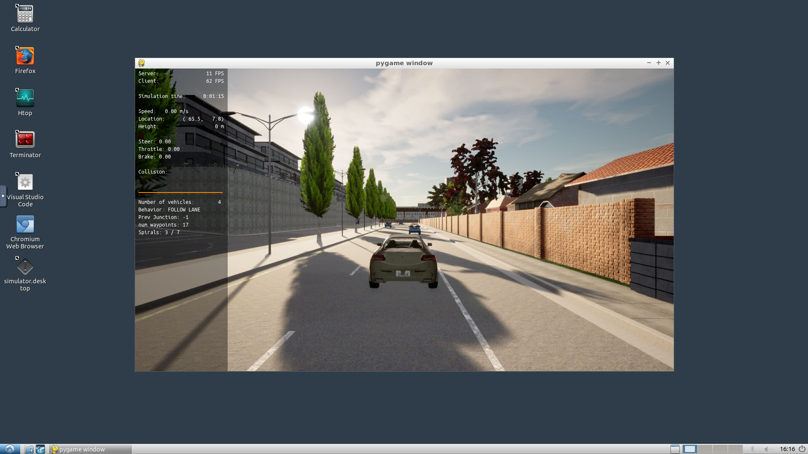
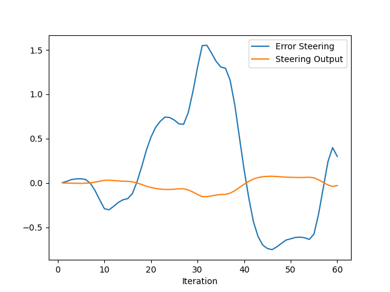
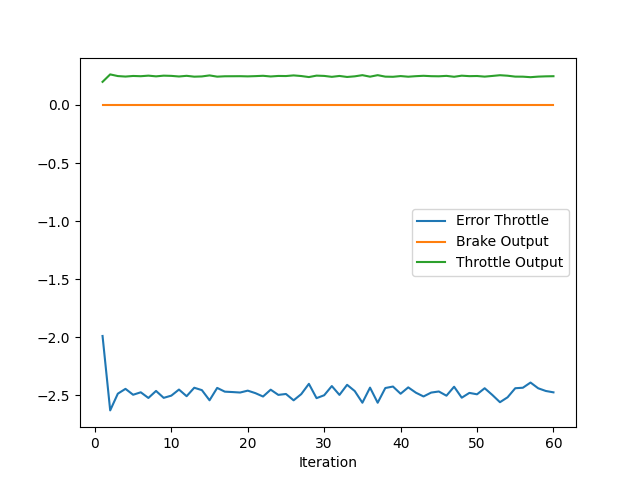
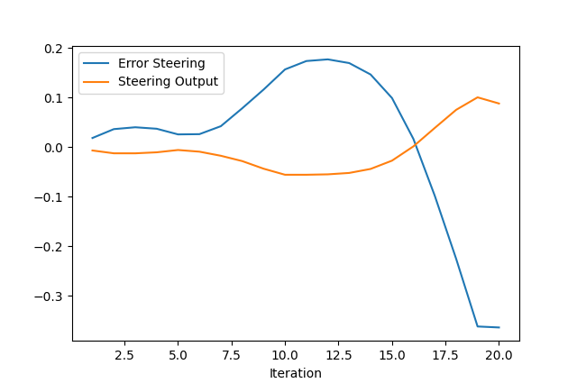
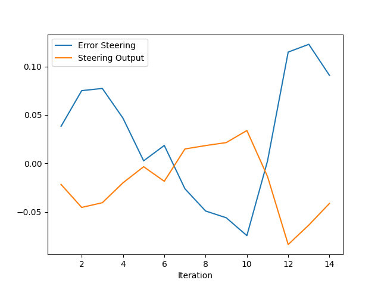
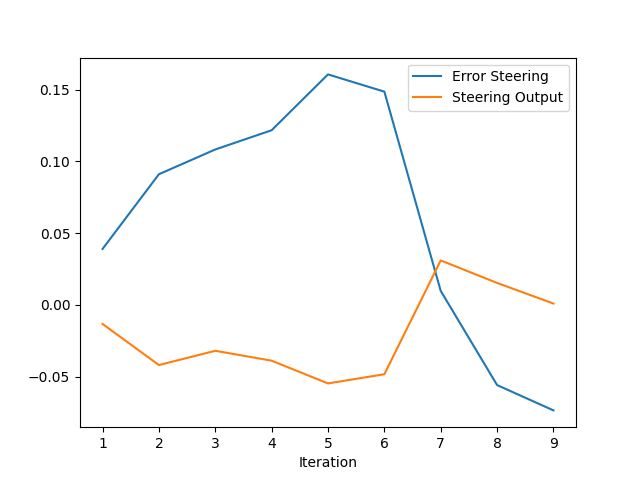
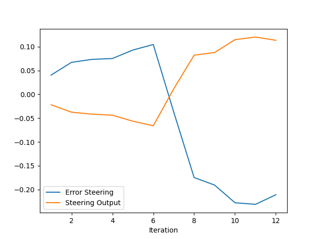
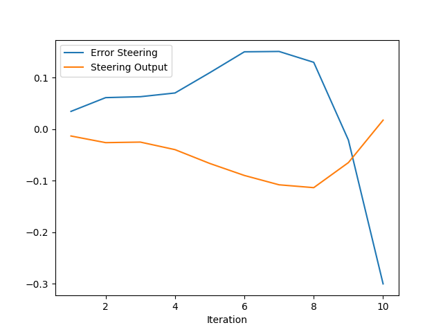

# Control and Trajectory Tracking for Autonomous Vehicle

This repository contains only the student submission code, as such some extra dependencies have been removed to reduce repo size. For the full code please see the original github repoistory by [udacity](https://github.com/udacity/nd013-c6-control-starter).

## Proportional-Integral-Derivative (PID)

### 1. Add the plots to your report and explain them (describe what you see)

**Test Vales**
| TEST | KP_STEER | KI_STEER | KD_STEER| KP_THROTTLE | KI_THROTTLE | KD_THROTTLE|
|:-------------------------:|:-------------------------:|:-------------------------:|:-------------------------:|:-------------------------:|:-------------------------:|:-------------------------:|
|ref/untuned|0.1|0.0|0.0|0.1|0.0|0.0|
|1| 0.25 | 0.01| 0.25 | 0.15 | 0.01 | 0.05 |
|2| 0.45| 0.02| 0.25| 0.18 | 0.15 | 0.1 |
|3| 0.2 | 0.02 | 0.4 | 0.1 | 0.15 | 0.25 |
|4| 0.5 | 0.02 | 0.05 | 0.3 | 0.1 | 0.1 |
|5| 0.1 | 0.1 | 0.3 | 0.2 | 0.05 | 0.1 |

**Plots**

| TEST | STEER | THROTTLE |
|:-------------------------:|:-------------------------:|:-------------------------:|
|ref/untuned|  ||
|1          |   ||
|2          |   ||
|3          |   ||
|4          |   ||
|5          |   ||

### 2. What is the effect of the PID according to the plots, how each part of the PID affects the control command?
* *proportional gain KP* -> command magnitude for a given error input.
* *proportional gain KI* -> command bias/offset correction -> visible mostly in throttle PID.
* *proportional gain KD* -> command rate of change -> command is more sensible to when the error increases.

### 3. How would you design a way to automatically tune the PID parameters?
In the course the Twiddle algorithm is presented, but other methods can be considered such as [Bayesian Optimization](https://en.wikipedia.org/wiki/Bayesian_optimization) wich may converge to a better results in fewer iterations (This a huge benefit if running many simulations iterations in not feasible due to hardware limitations)

### 4. PID controller is a model free controller, i.e. it does not use a model of the car. Could you explain the pros and cons of this type of controller?
PID in my view has two main advantages in this regard: dynamic modelling is not trivial and thus PID can be applied when a model is not avaliable, moreover it is a rather simple algorithm to compute, making it suitable to run on embedded/low-power platforms. On the other hand model-based controllers have considerable benefits: for example [MPC](https://en.wikipedia.org/wiki/Model_predictive_control) can produce much better results because it takes in account the whole planned trajectory and not just a single reference point in each step.

### 5. (Optional) What would you do to improve the PID controller?
Two main suggestions:
1. Controller would greately benefit from a greater frequency -> indeed closed loop systems should run as fast as the computer allows.
2. Filtering the PID output should (e.g [exponential filter](https://en.wikipedia.org/wiki/Exponential_smoothing)) be taken in consideration -> it could help filter out issues due to noise in the error signal.
